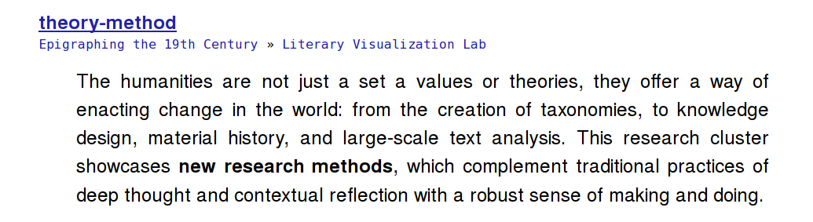
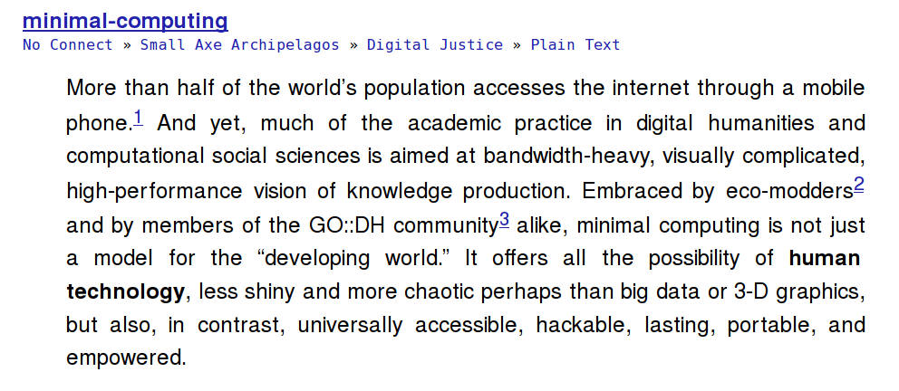
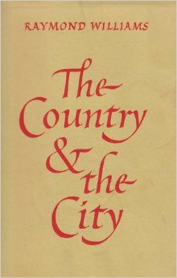
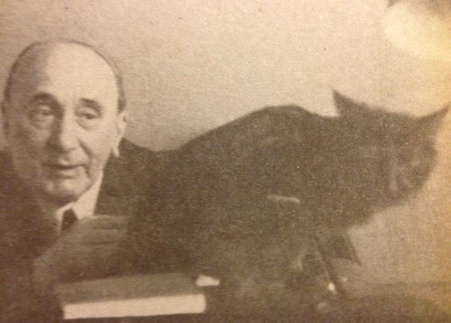
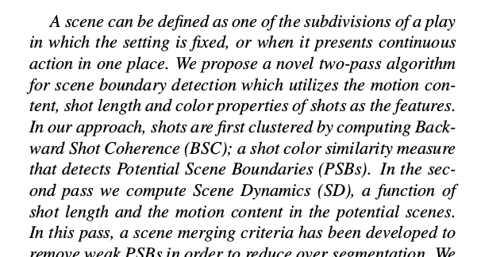

% Scene Detection in Literary Fiction
% Dennis Tenen
% xpmethod.plaintext.in

# Since our Last Time
## Writing a book

Microscope!

---

## Running a lab

---

Three research clusters:

- theory / method
- public discourse
- minimal computing

---

---

---

## 

Two projects of interest to this group:

1. Emerging Consensus in Scientific Literature (w/ Dan Jurafsky, Dan
MacFarland of Stanford, and Laura Kurgan of Spatial Information Lab)

---

2. Scene Detection in Literary fiction (w/ Kathy Mckewan)

# Scene Detection

## Original Paper

1. Raymond Williams

---

2. Bakhtin

---

Suggested improvement: networks over time

---

Complexity! Lack of models for theoretical primitives. 

- space
- time
- actors
- relations

---

Chunking. Preliminary observations:

- Typographical space (paragraph)
- Diegetic space (scene)

How do the two relate?

---

What is a scene?

Burke, Kenneth. *A Grammar of Motives*. University of California Press, 1969.

---

Rasheed, Z., and M. Shah. “Scene Detection in Hollywood Movies and TV Shows.”
In 2003 *IEEE Computer Society Conference on Computer Vision and Pattern
Recognition*, 2003. Proceedings, 2:II – 343–48 vol.2, 2003.

---

Complications:

- actors can become scenes
- scenes can become actors
- scenes can involve mental states and ideologies

---

Proposed algorithm:

1. Separate actors from background through grammatical categories (object,
subject, transitive verb, A blanks B)

2. Cluster scene particulates semantically to detect potential boundaries

---

Ground truth, a stumbling block as always. To overcome: expert tagging,
parallel copora. Any ideas?

---

We need better primitives to build more complex models!
